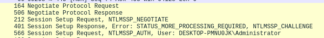
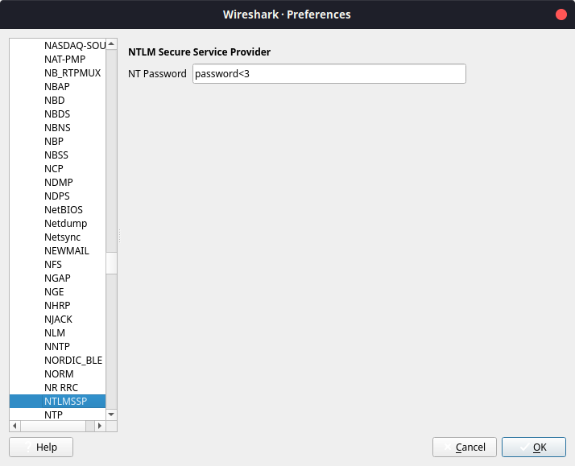
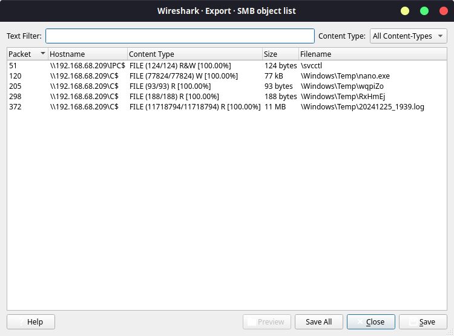

# Wargames.MY CTF 2024 Oh Man

## Description

We received a PCAP file from an admin who suspects an attacker exfiltrated sensitive data. Can you analyze the PCAP file and uncover what was stolen?

## Attached files

- `ohman.zip`
    - `wgmy-ohman.pcap`

## Solve procedure

### Investigating the network capture

When opening the file we can see that the file consists of Encrypted SMB3 data, so first we have to decrypt it.

### Obtaining the NTLM SSP hash (and password)

To obtain the NTLM SSP hash from the network capture we are going to focus on the following packets. In this capture there are two authentication attempts, one failed attempt and a correct attempt, so we will focus on the latter.



We need to extract the following data from this authentication attempt.

```
User: Administrator
Domain: DESKTOP-PMNU0JK
NTLM Challenge: 7aaff6ea26301fc3
HMAC-MD5: ae62a57caaa5dd94b68def8fb1c192f3
NTLMv2Response: ae62a57caaa5dd94b68def8fb1c192f301010000000000008675779b2e57db01376f686e57504d770000000002001e004400450053004b0054004f0050002d0050004d004e00550030004a004b0001001e004400450053004b0054004f0050002d0050004d004e00550030004a004b0004001e004400450053004b0054004f0050002d0050004d004e00550030004a004b0003001e004400450053004b0054004f0050002d0050004d004e00550030004a004b00070008008675779b2e57db010900280063006900660073002f004400450053004b0054004f0050002d0050004d004e00550030004a004b000000000000000000
```

Once we have this, we can format it as a hash and then run it through hashcat. You can see a more detailed video on how to extract the credentials [here](https://www.youtube.com/watch?v=lhhlgoMjM7o).

After running it in hashcat, we can determine the password is `password<3`

### Decrypting the SMB3 traffic

To do this, on wireshark we will input the password in `Edit > Preferences > Protocol > NTLM SSP`



Now we can see that the SMB traffic can be read with no issues. Next we will export all the objects using `File > Export objects > SMB...` and save all.



### Analyzing minidump

We can see a few files in here, one of them is a minidump, which is a file output by windows in case of a blue screen. We can also see a file called `RxHmEj` which gives us a clue.

```
The minidump has an invalid signature, restore it running:
scripts/restore_signature 20241225_1939.log
Done, to get the secretz run:
python3 -m pypykatz lsa minidump 20241225_1939.log
```

Looking up the script name we can reach the following [script](https://github.com/fortra/nanodump/blob/main/scripts/restore_signature).

I downloaded it and ran it and guess what it output!

```
done, to analize the dump run:
python3 -m pypykatz lsa minidump ../extracted_data/20241225_1939.log
```

Next I ran that command and I was able to get the flag

```
...
== LogonSession ==
authentication_id 339242 (52d2a)
session_id 1
username Administrator
domainname DESKTOP-PMNU0JK
logon_server DESKTOP-PMNU0JK
logon_time 2024-12-26T00:08:48.302370+00:00
sid S-1-5-21-152657954-3457636215-2968948465-500
luid 339242
	== MSV ==
		Username: Administrator
		Domain: DESKTOP-PMNU0JK
		LM: NA
		NT: 2bbbf69f28445b3d64405f83e609a3b5
		SHA1: 7770d8429ec1f82cee34855e4ca95f499a06a8f3
		DPAPI: 7770d8429ec1f82cee34855e4ca95f499a06a8f3
	== WDIGEST [52d2a]==
		username Administrator
		domainname DESKTOP-PMNU0JK
		password None
		password (hex)
	== Kerberos ==
		Username: Administrator
		Domain: DESKTOP-PMNU0JK
	== WDIGEST [52d2a]==
		username Administrator
		domainname DESKTOP-PMNU0JK
		password None
		password (hex)
	== CREDMAN [52d2a]==
		luid 339242
		username wgmy
		domain wargames.my
		password wgmy{fbba48bee397414246f864fe4d2925e4}
		password (hex)770067006d0079007b00660062006200610034003800620065006500330039003700340031003400320034003600660038003600340066006500340064003200390032003500650034007d0000000000
	== DPAPI [52d2a]==
		luid 339242
		key_guid 3f2e1f8e-6e46-401f-9eaf-c04ae5fce736
		masterkey b44f25f6d196a92f77f22ecc14db19b574b3f266b44a48ed132b8268d3241a966b15d937cbfc6b6c364222743fd93b3f0ecb1c6c4ebe326727f981376c34c7f0
		sha1_masterkey adc7c99f9546f4374b9ee78d6a56fea568cea802
...
```

## Flag

`wgmy{fbba48bee397414246f864fe4d2925e4}`