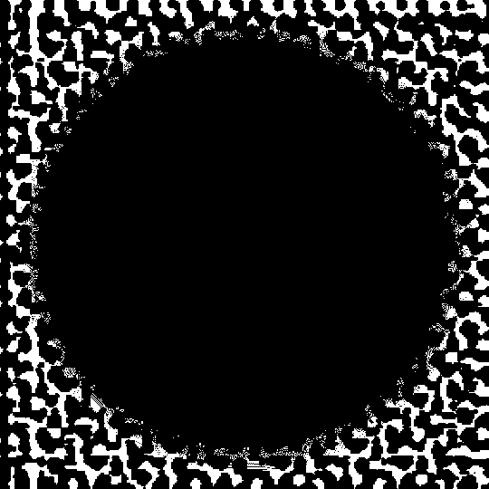
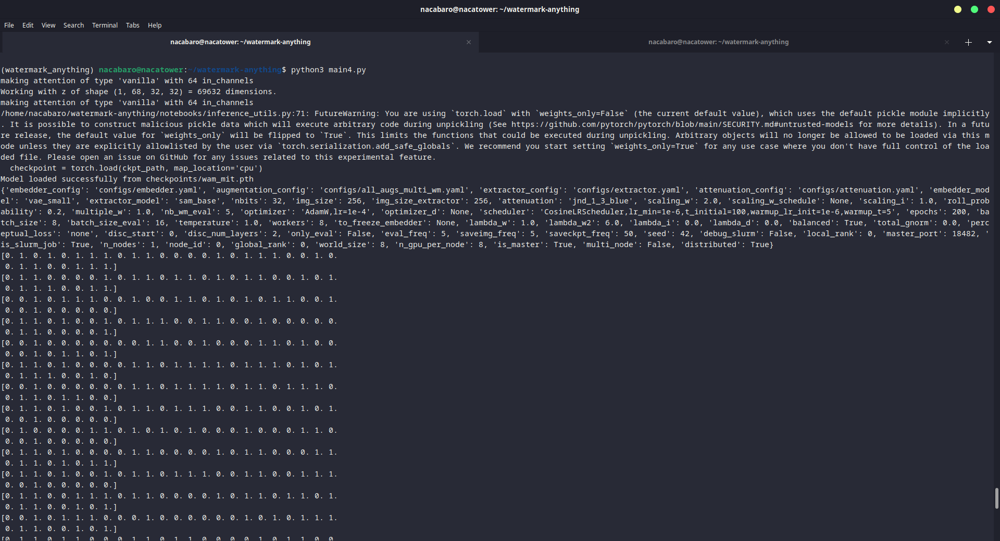

# Wargames.MY CTF 2024 WatermarkEverything

## Description

Got this from social media, someone said it's watermarked, is it?

## Files attached

- `watermarked.gif`

## Solve procedure

### Extracting the GIF data as PNG 

```bash
ffmpeg -i watermarked.gif frames%d.png
```

### Obtain the patterns

```python
from PIL import Image
import numpy as np

img = Image.open('output/watermarked.png').convert("RGB")

pixels_count = {}

height, weight = img.size

for y in range(height):
    for x in range(weight):
        if img.getpixel((x, y)) not in pixels_count:
            pixels_count.update({img.getpixel((x, y)): 1})
        else:
            pixels_count[img.getpixel((x, y))] += 1
    

sorted_pixels = sorted(pixels_count.items(), key=lambda x: x[1], reverse=True)

img_array = np.array(img)
mask = np.all(img_array == [0, 4, 0], axis=-1)

img_array[mask] = [255, 255, 255]
img_array[~mask] = [0, 0, 0]

modified_img = Image.fromarray(img_array)

modified_img.show()
```

Using this script we can see the watermark from the image



### Installing Watermark Anything

```bash
conda create -n "watermark_anything" python=3.10.14
conda activate watermark_anything
conda install pytorch torchvision pytorch-cuda=12.4 -c pytorch -c nvidia

pip install -r requirements.txt
```

Next we download the weigths

```bash
wget https://dl.fbaipublicfiles.com/watermark_anything/wam_mit.pth -P checkpoints/
```

The script we used to obtain the flag is the following

```python
import os
import numpy as np
from PIL import Image
import torch
import torch.nn.functional as F
from torchvision.utils import save_image

from watermark_anything.data.metrics import msg_predict_inference
from notebooks.inference_utils import (
    load_model_from_checkpoint, default_transform, unnormalize_img,
    create_random_mask, plot_outputs, msg2str
)

device = torch.device("cuda" if torch.cuda.is_available() else "cpu")

exp_dir = "checkpoints"
json_path = os.path.join(exp_dir, "params.json")
ckpt_path = os.path.join(exp_dir, 'wam_mit.pth')
wam = load_model_from_checkpoint(json_path, ckpt_path).to(device).eval()

img_dir = "frames/"
output_dir = "outputs"
os.makedirs(output_dir, exist_ok=True)

imgs = os.listdir(img_dir)
imgs.sort()

for img_ in imgs:
    img_path = os.path.join(img_dir, img_)
    img = Image.open(img_path).convert("RGB")
    img_pt = default_transform(img).unsqueeze(0).to(device)
    
    # Detect watermark in the image directly
    preds = wam.detect(img_pt)["preds"]  # [1, 33, 256, 256]
    mask_preds = F.sigmoid(preds[:, 0, :, :])  # [1, 256, 256]
    bit_preds = preds[:, 1:, :, :]            # [1, 32, 256, 256]
    
    pred_message = msg_predict_inference(bit_preds, mask_preds).cpu().float()

    # Optionally save detection results
    mask_preds_res = F.interpolate(
        mask_preds.unsqueeze(1), 
        size=(img_pt.shape[-2], img_pt.shape[-1]), 
        mode="bilinear", 
        align_corners=False
    )
    save_image(unnormalize_img(img_pt), f"{output_dir}/{img_}_original.png")
    save_image(mask_preds_res, f"{output_dir}/{img_}_predmask.png")
    print(pred_message[0].numpy())
```

During the competition we did not load the weights correctly and the mask was not being generated correctly... After loading the weighs correctly we can see the following:



Conevrting the code from binary to ASCII we can see the following

`Wargames.MY is a 24-hour online CTF hacking game. Well, it is a competition of sorts. Congrats on solving this challenge! This is for you: wgmy{2cc46df0fb62c2a92732a4d252b8d9a7}. Thanks for playing with us. We hope you enjoy solving our challenges. -- WGMY2024`

## Flag

`wgmy{2cc46df0fb62c2a92732a4d252b8d9a7}`