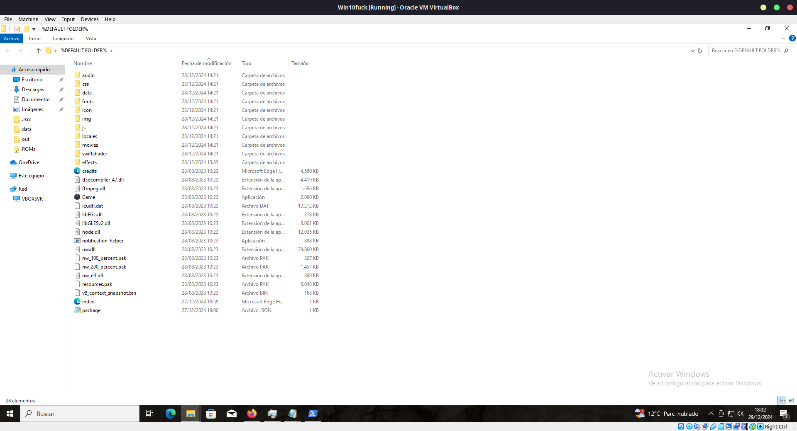

# Wargames.MY CTF 2024 World 1

## Description

Game hacking is back!

Can you save the princess?

White screen? That is a part of the challenge, try to overcome it.

## Attached files

- `World 1.zip`
    - `World 1.exe`

## Solve procedure

### Identifying the game engine and the executable packing

We are going to begin by identifying the game engine. So we are going to extract the executable as if it were a zip file with 7Zip.

Opening the file we can already get a few clues, inside the executable data we can see a file called `.enigma1` and `.enigma2`.

Also, inside the `.rsrc` folder we can see a file called `version.txt`, opening it we can see the game is running in NW.js... This will come useful later for World 2 and World 3.

### Unpacking the executable

Researching enigma executable we can learn that the executable was packed with Enigma Virtual Box. Looking deeper we can find an unpacker for these executables.

`https://lifeinhex.com/tag/unpacker/`

Once the data was extracted, we can see the following

This already starts to look more familiar. We can also run the game by running `Game.exe`. 

This will also help us at solving the World 2 and World 3 challenges.

### Getting around the white screen

We ran the application as administrator and it worked.

### Getting around the game

The flag fragments are the following

- Flag fragment 1: Beat first boss
- Flag fragment 2: Beat second boss
- Flag fragment 3: It's inside a chest
- Flag fragment 4: It's shown in the lava map of the castle in the floor tileset
- Flag fragment 5: Obtained as a QR code after defeating boss #5

To beat the bosses faster, we changed their health to only 1 HP, so that they would die after one hit.

## Flag

`wgmy{5ce7d7a7140ebabf5cd43effd3fcaac2}`