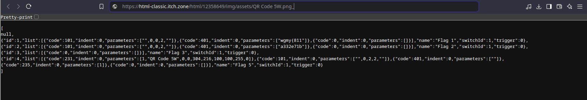

# Wargames.MY CTF 2024 World 3

## Description

Welp, time to do it again and again.

Pw: WGMY2024

## Link attached:

- `https://monaruku.itch.io/wgmy2024`

## Solve procedure

We can see it's the same game, this time running in the web browser.

### Obtaining the game data

To get what matters, we are going to inspect element, and then on the `Network` tab we can see that the game's JSON files are downloaded right at the beginning, so we just swap these JSON games with the ones in the executable from World 1.

Next we are going to change the HP for the bosses again, and then finish the game again.

### Getting the QR code

By looking inside the `CommonEvents.json` we can get the name of the QR code file and then download it by using the same file structure as the Windows executable

We replace this and go through the game.

## Flag

Later
