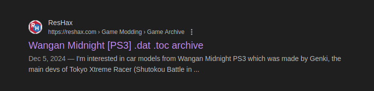
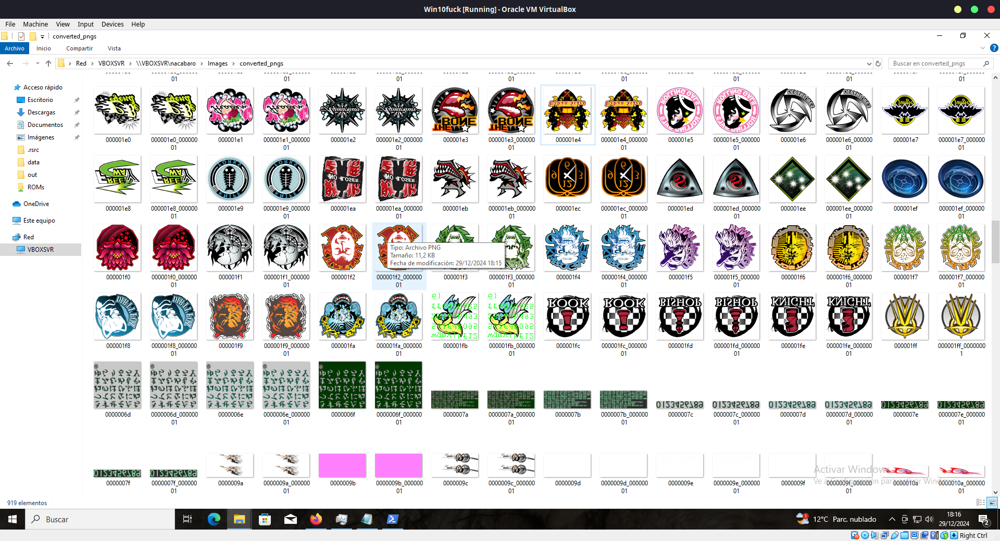
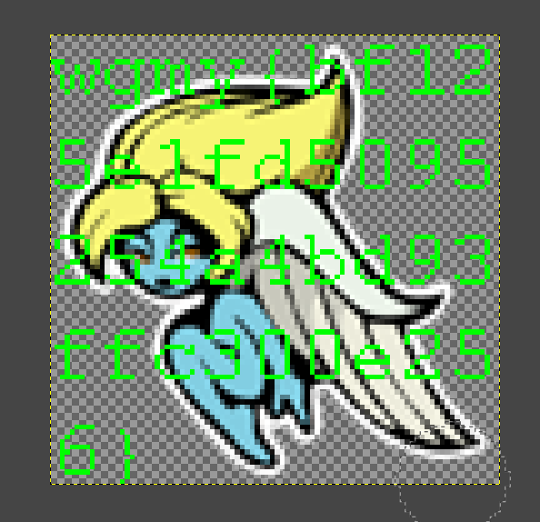

# Wargames.MY CTF 2024 迅帝

## Description

I created this chal just because people keep asking for OSINT chal in WGMY 2023. Here we go:

"18 years, I waited 18 years and finally they are active once again. We managed to obtain some artifact from their last work, it seem a secret message is hidden deep inside. Find out what to do with these files. Oh, right, our agent has further message for you: 'Melancholy Angel holds the flag.' Good Luck, you need it."

## Attached files

- `Build.zip`
    - `BUILD.DAT`
    - `BUILD.TOC`

## Solve procedure

### Investigating the files

First and foremost, we need to investigate the data obtained from this file. Looking in Google for the file extensions we can see the following: 



This is already pointing at us in the right direction. Looking for Melancholy Angel we can establish a link between the Tokyo XTreme Racer game with the Wangan Midnight post.

`https://tokyoxtremeracer.fandom.com/wiki/Melancholy_Angel_(ITC)`

Knowing this, we already have a clue on how to proceed. We can also assume these files are related to a game, and comparing our files with the ones in the Wangan Midnight post, we can see they are a similar set of files

### Extracting the files

For this we will try using a script from QuickBMS, since the toolkit specificed in the Wangan Midnight post did not work. We can find our script here:

`https://www.zenhax.com/viewtopic.php@t=957.html`

Looking between the posts we can see an official QuickBMS script for extracting the data from Tokyo Xtreme Racer `*.dat` `*.toc` files.

`http://aluigi.org/papers/bms/others/tokyo_xtreme_racer.bms`

Running this we can extract all the files from the data. Doing so will result in a folder of over 5 GB worth of data.

### Identifying the files extracted

Most of the files extracted have a propietary file extensions, but we can quickly see over the extracted files a lot of images in the `*.tga` file format. Seeing this we will go ahead and skim through all the pictures by converting them first to `*.png` so that it is viewable through the file explorer.

```bash
mkdir -p converted_pngs && for f in *.tga; do convert "$f" "converted_pngs/${f%.tga}.png"; done
```



Opening the file and rotating / mirroring the image will return the following



## Flag

`wgmy{bf125e1fd5095254a4bd93ffc300e256}`